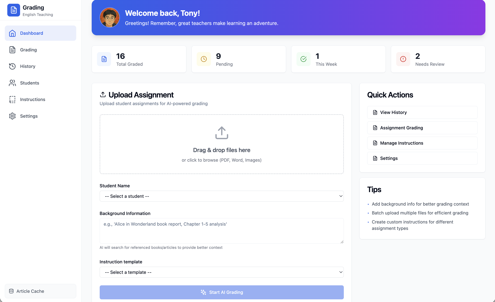
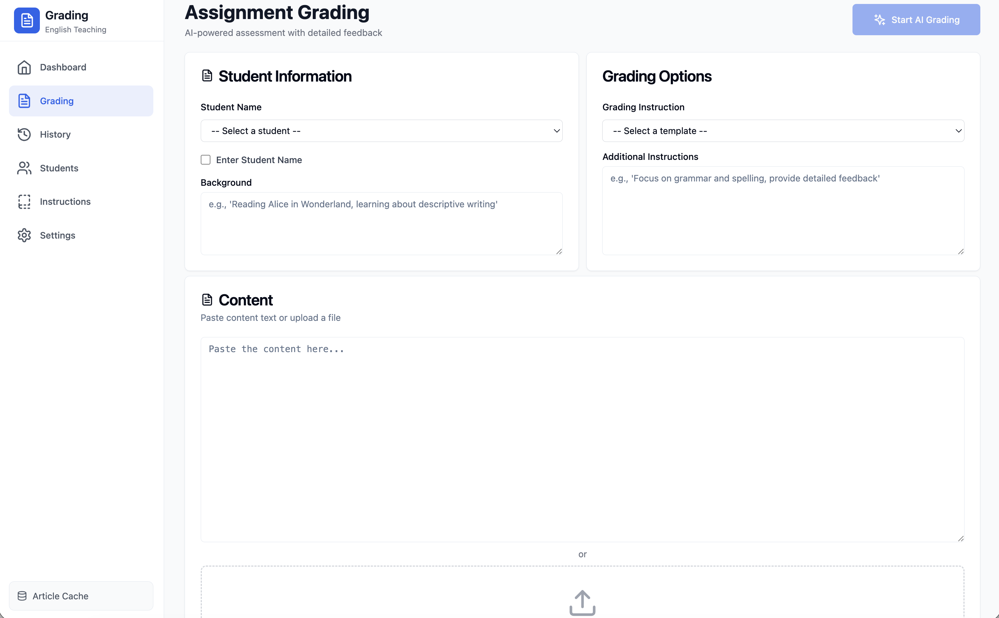
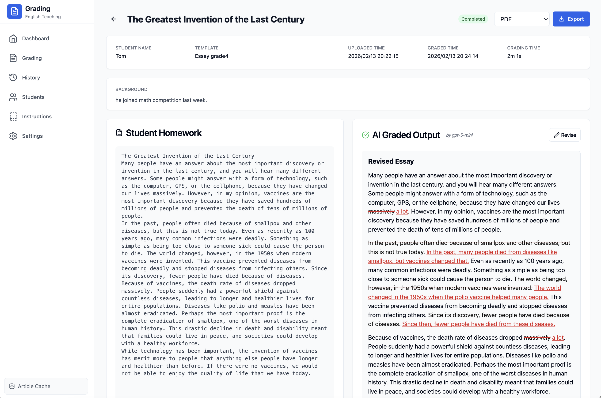
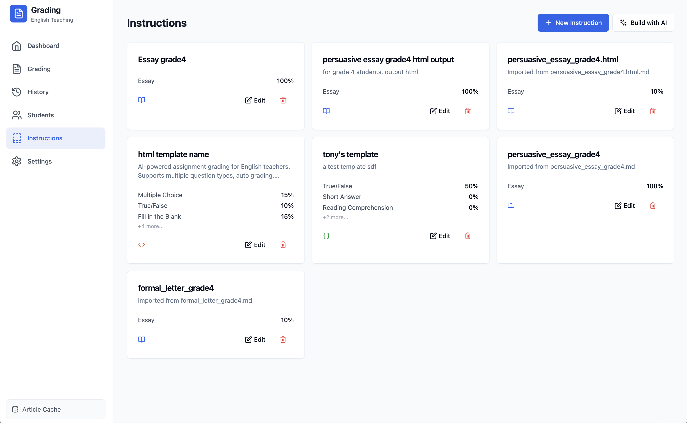
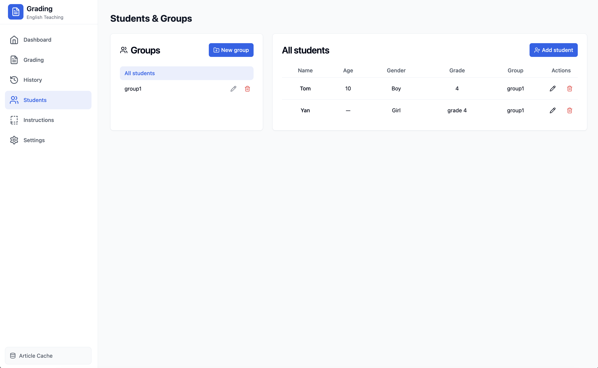
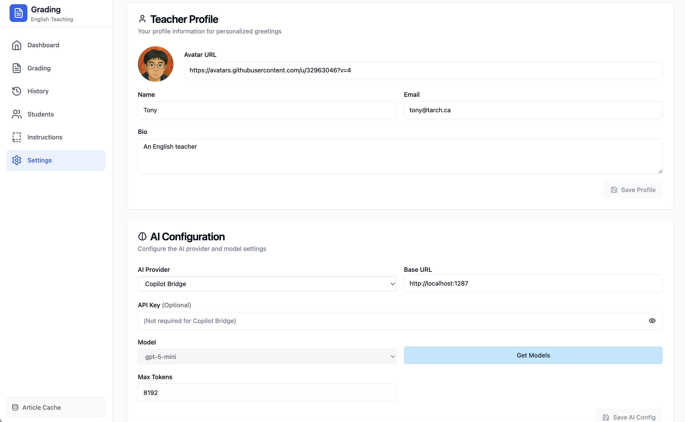

# English Teaching Assignment Grading System

This is a comprehensive AI-powered grading assistant designed specifically for English teachers. The application streamlines the assignment grading workflow by leveraging advanced AI models to provide detailed, personalized feedback on student work.

### Key Features

- **AI-Powered Grading**: Utilizes multiple AI providers (OpenAI, Anthropic, Google Gemini, ZhipuAI, Copilot Bridge) to automatically grade assignments with detailed feedback
- **Multi-Format Support**: Accepts assignments in TXT, PDF, and Word (.DOCX, .DOC) formats
- **Customizable Grading Instructions**: Create and manage grading templates with configurable question types and weights
- **Student Management**: Organize students into groups, track individual progress, and maintain student profiles
- **Grading History**: Complete history of all graded assignments with search, filter, and sort capabilities
- **Export Options**: Export graded results to PDF, Word (DOCX), or HTML formats
- **Personalized Greetings**: Customizable greeting messages based on teacher profile and student information
- **Background Context**: Add background information to help AI understand assignment context for better grading

### Application Pages

| Page | Description |
|------|-------------|
| **Dashboard** | Main landing page with stats overview, file upload, and quick grading actions |
| **Grading** | Full-featured grading interface with student info and grading options |
| **Grading Result** | Side-by-side view of student work and AI-graded output with export |
| **History** | Complete grading history with search, filter, and pagination |
| **Instructions** | Manage grading templates with question types and weights |
| **Students** | Manage student groups and individual student profiles |
| **Settings** | Configure AI provider, teacher profile, and application settings |

---

## Screenshots

### Dashboard


The main landing page displays grading statistics (total graded, pending, this week, needs review), a file upload section for assignments, student selection, background information input, and quick action buttons for navigation.

### Grading Interface


The grading page provides a comprehensive interface for AI-powered assessment with student information panel, grading options including template selection and additional instructions, and a content area for pasting text or uploading files.

### Grading Results


The results page displays the student's original work on the left and the AI-generated graded output on the right, including scores, detailed feedback, and options to revise or export to PDF/Word/HTML.

### History Page


The history page provides a complete record of all assignments with search functionality, status filtering, sortable columns, pagination, and the ability to delete entries.

### Instructions/Templates


The instructions page allows teachers to create and manage grading templates with customizable question types (Multiple Choice, True/False, Fill in the Blank, Short Answer, Reading Comprehension, Picture Description, Essay), weights, encouragement words, and detailed grading criteria in multiple formats (text, markdown, HTML, JSON).

### Students Management


The students page enables organizing students into groups, managing individual student profiles with details like age, gender, grade, vocabulary level, and additional notes for personalized grading context.

### Settings Page


The settings page provides configuration options for teacher profile (name, email, avatar, bio), AI provider settings (OpenAI, Anthropic, Google Gemini, ZhipuAI, Copilot Bridge), model selection, API keys, and search engine preferences.

---

## Quick Start

### Local Development

```bash
./scripts/start.sh
```

Frontend: http://localhost:3090 | Backend: http://localhost:8090 | Docs: http://localhost:8090/docs

### Docker Container

```bash
docker-compose up -d
```

Frontend: http://localhost:9011 | Backend: http://localhost:8090 (internal only)

---

## Build Docker Images

### Build Backend

```bash
cd backend
docker build --tag ghcr.io/$REGISTRY_OWNER/teaching-assistant:backend-0.1.1 .
```

### Build Frontend

```bash
cd frontend
docker build --tag ghcr.io/$REGISTRY_OWNER/teaching-assistant:frontend-0.1.1 .
```

### Build Both

```bash
./scripts/build.sh
```

---

## Docker Compose Setup

### Initialize Environment (macOS)

```bash
bash scripts/docker-init.sh
```

This creates:

- `.env` file with your macOS username and paths
- Data folder: `~/apps/teaching-assistant/data`
- Logs folder: `~/apps/teaching-assistant/logs`

### Alternative: Manual Setup

```bash
# Copy example env file
cp .env.example .env

# Edit .env with your values
# REGISTRY_OWNER=your-username
# DATA_PATH=${HOME}/apps/teaching-assistant/data
# LOGS_PATH=${HOME}/apps/teaching-assistant/logs

# Create folders
mkdir -p ~/apps/teaching-assistant/data
mkdir -p ~/apps/teaching-assistant/logs
```

### Start Services

```bash
docker-compose up -d
```

### View Logs

```bash
docker-compose logs -f backend
docker-compose logs -f frontend
```

### Stop Services

```bash
docker-compose down
```

### Stop & Remove Volumes

```bash
docker-compose down -v
```

### Folder Mounting

```yaml
Host Path                                   Container Path
~/apps/teaching-assistant/data       →      /app/data
~/apps/teaching-assistant/logs       →      /app/logs
```

### Verify Mount

```bash
# Check from container
docker-compose exec backend ls -la /app/data

# Check from host
ls -la ~/apps/teaching-assistant/data
```

---

## Local Development Setup

### Backend

```bash
cd backend
python3 -m venv venv
source venv/bin/activate
pip install -r requirements.txt
python -m uvicorn main:app --host 0.0.0.0 --port 8090 --reload
```

### Frontend

```bash
cd frontend
npm install
npm run dev
```

### Database

```bash
./scripts/init_db.sh
```

---

## Project Structure

- `backend/` — FastAPI, services, SQLite DB
- `frontend/` — React + TypeScript + Vite
- `config.yaml` — Server, logging, storage config
- `data/` — Database and uploads (gitignored)
- `logs/` — Application logs (gitignored)
- `scripts/` — Start/stop/build helpers

---

## Security

- Do not commit `.env` or API keys
- Use environment variables for secrets
- Set `TEACHING_ENCRYPTION_KEY` in production
- Keep `data/`, `logs/`, `.env` out of repo

---

## License

MIT License. See [LICENSE](LICENSE).

## Author

**Tony Xu** — tony@tarch.ca
